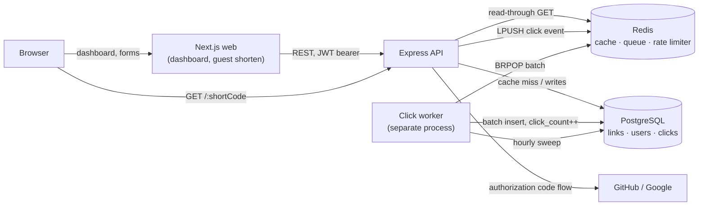

# Architecture

This is the engineering write-up for [LinkPulse](README.md): what the system
looks like, the decisions behind it, and the numbers that back them up. The
short version - project description, features, how to run it - is the
README; this is the depth behind it.

## System overview

Two things this diagram is trying to make visible: the redirect path
(`Browser → API → Redis`) never touches the worker or, on a cache hit,
Postgres at all - and the worker is a fully separate process from the API,
not a background thread inside it.

## Design decisions

Each of these is a choice with a real alternative that was rejected, not the
only way to build the feature.

### Redirect hot path: Redis read-through cache

`GET /:shortCode` checks Redis first. On a hit, it never touches Postgres.
On a miss, it queries Postgres, populates Redis (including a short-TTL
**negative cache** entry for a nonexistent code, so a scanner probing random
codes can't turn every miss into a database query), and redirects. Every
click is queued to Redis (`LPUSH`) and returns to the browser immediately;
nothing about processing that click happens before the response is sent.

**Alternative rejected:** querying Postgres directly per redirect. Simpler,
but couples the latency-critical path to the database's own load, and
removes the option to shed load by scaling Redis independently.

### Async click processing: a separate worker process

Click enrichment (geo-IP lookup, user-agent parsing, referrer
normalization) happens in a dedicated worker process (`src/worker.ts`),
not inline in the API. It drains Redis (`BRPOP`, batched) and batch-writes
to Postgres.

**Why a separate process, not just an async function in the API:** the
geo-IP database (`geoip-lite`) costs ~110 MB of resident memory once
loaded - measured live, the api container holds ~50 MB against the worker's
~170 MB. Loading it into the same process as the redirect path would tax
every request's memory footprint for a lookup the redirect path itself never
needs.

### Auth: in-memory JWT + rotating, revocable refresh tokens

Access tokens are short-lived (15 min default) JWTs, held in the browser's
memory only - never `localStorage`, so a single XSS cannot exfiltrate a
long-lived credential. Refresh tokens are opaque random strings, stored as a
SHA-256 hash (never the token itself) in Postgres, delivered via an
httpOnly, path-scoped cookie.

Every refresh **rotates** the token and revokes the one presented. If an
already-rotated (and thus already-revoked) token is ever presented again,
that's a signal two parties are holding it - the entire token family is
revoked, forcing re-authentication rather than guessing which holder is the
attacker.

**Alternative rejected:** NextAuth.js, as the original spec called for.
NextAuth is built to run inside a Next.js app's own server; this project's
sessions are issued and verified entirely by a separate Express API (which
also has to serve non-browser callers like k6 and curl). Adopting it would
have meant either running two parallel session systems or restructuring the
whole auth boundary around Next.js - not a small swap for a real benefit,
so the JWT/refresh design above is hand-rolled and consistent everywhere
else auth is checked (rate-limit tiers, ownership checks, `req.actor`).

### Rate limiting: sliding window via a Redis Lua script

A sliding-window counter, blending the current and previous fixed windows
weighted by overlap, implemented as a Lua script so the read-check-increment
sequence is atomic under concurrent requests (`EVALSHA`, cached script hash).
Two tiers per route - a tighter one for anonymous callers (keyed by IP) and
a looser one for authenticated callers (keyed by user id) - configured
independently per endpoint class (redirect, create, general API, auth).

**Alternative rejected:** a naive `INCR` + `EXPIRE` fixed window. Simpler,
but allows up to 2x the intended rate at window boundaries (a burst just
before and just after a window resets). The blended sliding window bounds
that to the configured rate regardless of timing.

### Abuse: quotas and a captcha, not just request rates

A rate limit alone bounds how fast one identity acts, and accounts are free,
so an identity is not a scarce resource: one IP registering N accounts gets
N times the per-user budget, and every link it creates is permanent. Three
layers close that, each doing what the others cannot:

- **A per-IP link-creation budget** on `POST /api/links`, charged in
  addition to the per-user limit and keyed by IP no matter which account is
  signed in - so registering more accounts buys no extra creation rate from
  one machine.
- **A per-account link quota** (`MAX_LINKS_PER_USER`), which bounds stored
  rows rather than request rate: without it an account can stay just under
  the rate ceiling forever and still grow the table without limit.
- **Cloudflare Turnstile** on the two anonymous browser forms (register,
  guest shorten), optional and off unless `TURNSTILE_SECRET_KEY` is set.

Turnstile guards the forms, not the API: a script can still call
`/api/shorten` directly, which is what the first two layers are for. It
raises the cost of the path bulk signup traffic actually arrives on, and
nothing more - it is a second line, not the boundary.

**Alternative rejected: reCAPTCHA.** Same integration shape, but it loads
Google tracking scripts onto every page carrying it and obliges a privacy
disclosure. Turnstile adds no such dependency, and in `interaction-only`
mode shows nothing at all to a visitor it does not need to challenge.

**Alternative rejected: requiring email verification to sign up.** A
stronger bound on disposable accounts than any captcha, and the natural next
step - but it needs a mail provider, a deliverability story, and a token
lifecycle, none of which this project otherwise has a reason to run.

**Alternative rejected: fail-open captcha verification.** The rate limiter
deliberately fails open when Redis is down, because it still bounds nothing
worse than normal traffic if skipped. Turnstile verification fails _closed_:
skipping it leaves the form it guards completely unguarded, so a Cloudflare
outage blocking signups is the safer failure.

### Malicious-URL blocklist: a static domain list, not Safe Browsing API

Link creation and destination edits check the target hostname (and its
subdomains) against a configurable blocklist. The default list ships
Google's own documented Safe Browsing _test_ domains - real, but designed
to never resolve to anything harmful - so the feature is demonstrably
functional without requiring a Google Cloud API key or any external network
call on the write path.

**Alternative rejected:** the Google Safe Browsing API, which the spec
offered as an option. It requires an API key, a billing-adjacent Google
Cloud setup, and a network round-trip on every link write - real threat
intelligence a production deployment would want, but a worse fit for a
project meant to run end to end with `docker compose up -d` and no external
account.

### Charts: form before color

Per-link analytics follow a deliberate method (see the `dataviz` design
system this project's charts were built against): pick the chart form for
what's being shown before picking any color. A trend over time is a line
chart. A ranked, open-ended set (countries, browsers) is a single-hue
horizontal bar chart, not a categorical palette that runs out of
distinguishable colors past ~8 entries. A part-to-whole split of exactly
four fixed categories (device type) is the one chart that _is_ categorical,
using a palette validated for colorblind-safe separation and contrast, with
a visible legend wherever a color's contrast against its surface doesn't
clear the threshold on its own.

**Alternative rejected:** pie charts for device/browser breakdown, as the
original spec called for. Kept as bar charts instead - bar length is easier
to compare precisely than pie-slice angle, especially for an open-ended
"top N + Other" set a pie chart handles poorly.

### Deployment: one VM behind Caddy, not a PaaS

Live at [linkpulse.thedeepak.dev](https://linkpulse.thedeepak.dev): a single
AWS EC2 instance running the same `docker compose` shape as local dev, minus
Postgres (external Neon) and with Caddy added as a reverse proxy for
automatic HTTPS. `NEXT_PUBLIC_API_URL` is baked in empty at build time, so
the browser calls its own origin for everything and Caddy routes `/api/*`,
`/health*`, and short codes to the API container, everything else to the
Next.js app - one address does the whole job, and the domain can change
with no rebuild. Deploys are a manually-triggered GitHub Actions workflow
(`.github/workflows/deploy.yml`): it builds and pushes the web image, runs
`prisma migrate deploy` straight against Neon, then SSHes in and restarts
the stack - reading `DATABASE_URL`, `JWT_SECRET` and a dedicated deploy-only
SSH key from GitHub Secrets, never from a file on a laptop.

**Alternative rejected: a PaaS (Render, Fly.io).** Faster to click through
initially, but a PaaS's own deploy config doesn't carry over to a different
provider - moving from Render to a DigitalOcean droplet later would mean
building this same VM-plus-Compose recipe anyway. Building it once, now,
means the next move is copying three files to a new host and re-running one
workflow, not re-architecting the deployment.

**Alternative rejected: RDS instead of Neon for Postgres.** Reachable from
outside AWS if made public, so not strictly a lock-in - but it stays an AWS
resource billed from the same credit pool as the compute it's meant to be
independent of, and would still need a real migration the day AWS itself is
dropped. Neon never has to move, regardless of which cloud is running the
containers on any given day.

## Testing strategy

- **Unit tests** (Vitest) for pure logic: schema validation, the rate
  limiter's window math, the blocklist matcher, the cleanup queries.
- **Integration tests** (Vitest + Supertest) against a real Postgres and
  real Redis - not mocks - using a dedicated `linkpulse_test` database and a
  separate Redis logical database, so the suite is safe to run alongside a
  live dev stack.
- **k6 load tests** for the four scenarios in [Performance](#performance)
  below, each fully self-contained (`setup()` seeds its own throwaway user
  and data).
- **An isolated e2e Docker stack** (`docker-compose.e2e.yml`) for
  browser-driven manual/Playwright verification against a real running app,
  entirely separate from the dev stack's database. This exists because an
  earlier version of that workflow reused the dev stack directly and a
  cleanup command run against it once took a real account with it - the
  isolated stack makes that class of mistake structurally impossible rather
  than relying on care.

## Performance

Full methodology, raw notes, and the CPU-bottleneck diagnosis:
[`benchmarks/reports/RESULTS.md`](benchmarks/reports/RESULTS.md). Headline
results:

| Scenario                                             | Target                | Achieved RPS                   | P95  | Errors |
| ---------------------------------------------------- | --------------------- | ------------------------------ | ---- | ------ |
| Redirect Throughput (`GET /:shortCode`)              | >2,500 RPS, P95 <50ms | 2,077 (2,500 sustained target) | 40ms | 0%     |
| URL Creation (`POST /api/links`)                     | >200 RPS, P95 <200ms  | 457                            | 19ms | 0%     |
| Analytics Read (`GET /api/links/:id/analytics`)      | >100 RPS, P95 <300ms  | 280                            | 13ms | 0%     |
| Mixed Workload (80% redirect / 15% create / 5% read) | Stable under load     | 1,824                          | 30ms | 0%     |

Two things worth calling out about how these were produced, not just what
they say:

**The redirect scenario uses k6's `ramping-arrival-rate` executor, not a
fixed VU count.** A constant-VUs closed loop conflates "how many clients are
connected" with "how many requests per second arrive" - 500 VUs hammering
with no pacing pushed well past the RPS target but also self-induced queueing
(P95 rose to ~170ms), because raising VU count is not the same lever as
raising request rate. Asking k6 for the rate directly and letting it
allocate whatever VUs that takes is what actually measures "does the hot
path sustain 2,500 RPS at P95 <50ms."

**Pushing past the target found a real, diagnosed ceiling.** Sustaining
3,000 req/s tipped P95 past the 50ms threshold; sampling `docker stats`
during that run showed the `api` container pinned at ~110-130% CPU (one
core saturated) while `redis` and `postgres` sat at 20-26%. The bottleneck
is the single Node.js API process, not the cache or the database -
horizontal scaling (multiple API replicas behind a load balancer, which the
already-stateless JWT/refresh design needs no sticky sessions to support)
is the documented next step, not implemented here.

## Security

- Passwords hashed with bcrypt (cost 12); the same code path burns
  comparable time on an unknown email as on a wrong password, so a timing
  difference can't be used to enumerate registered addresses.
- Refresh tokens: opaque, hashed at rest, rotated on every use, with
  family-wide revocation on reuse detection (see [Auth](#auth-in-memory-jwt--rotating-revocable-refresh-tokens)
  above).
- Destination URLs are restricted to absolute `http(s)` - `javascript:` and
  `data:` URLs are rejected before they can ever be emitted into a
  `Location` header or an anchor `href`, closing a stored-XSS path.
- CORS is restricted to configured origins; `helmet` sets standard security
  headers; the API trusts exactly one reverse-proxy hop for `X-Forwarded-For`
  (configurable), not an unbounded chain a client could spoof.
- Click IP addresses are geo-resolved once; the derived country/city are
  what analytics actually reads. The schema (`clicks.ip_address`, nullable)
  and `IP_RETENTION_DAYS` are already in place for a job to null the raw
  address out after that window, but that job isn't built yet - see
  [What's next](#whats-next).
- Every write path (link create, link edit) - not just the redirect read
  path - is checked against the URL blocklist.

## What's next

Roughly in the order a real deployment would need them, not necessarily the
order they'd be fun to build:

1. **Horizontal API scaling** behind a load balancer, since the k6 results
   found the single-process ceiling directly - the current deployment is
   one instance.
2. **Metrics and tracing** - structured logs exist throughout (Pino); no
   Prometheus/Grafana/OpenTelemetry wiring yet.
3. **A real threat-intelligence feed** behind `URL_BLOCKLIST`, replacing the
   static list.
4. **Account linking** for a user who wants to add a second sign-in method
   to an existing account - deliberately out of scope now, since doing it
   safely needs its own confirmation flow, not a quick addition.
5. **The click-IP retention job.** The schema and `IP_RETENTION_DAYS`
   already anticipate it (`clicks.ip_address` is nullable specifically for
   this), but nothing nulls the address out yet - it persists indefinitely
   today.
