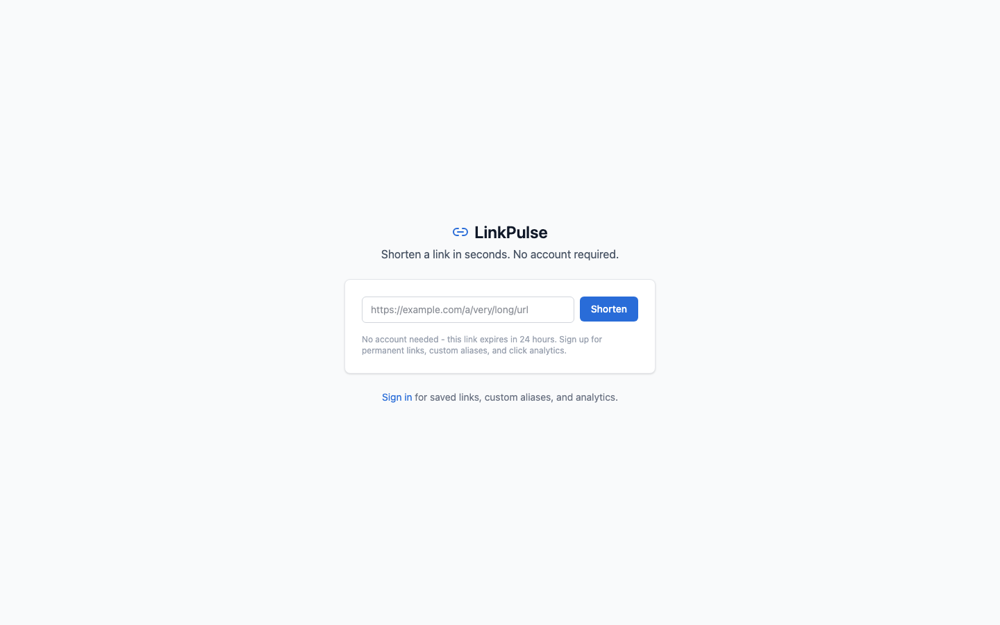
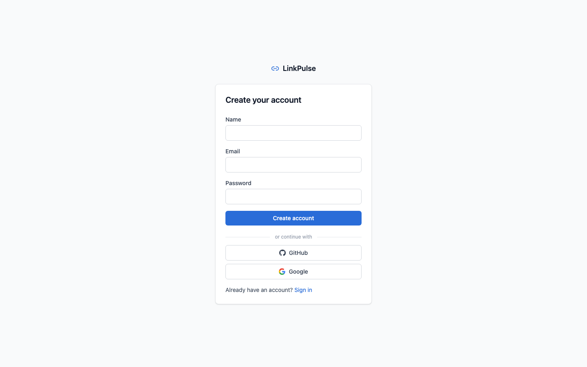
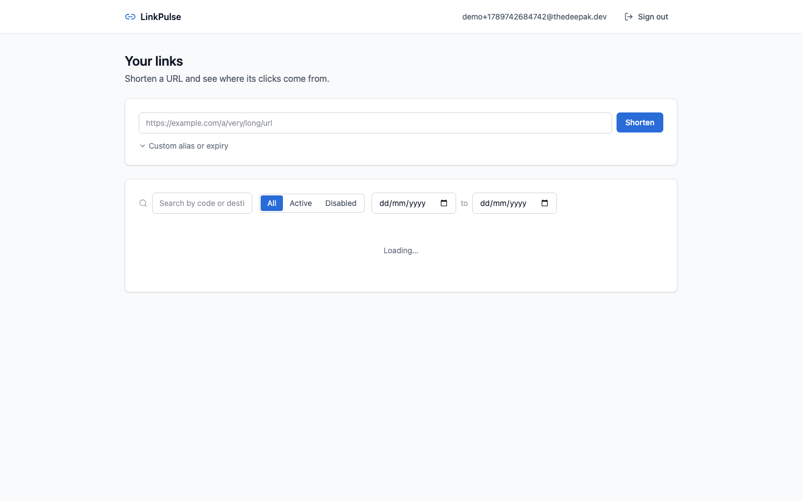
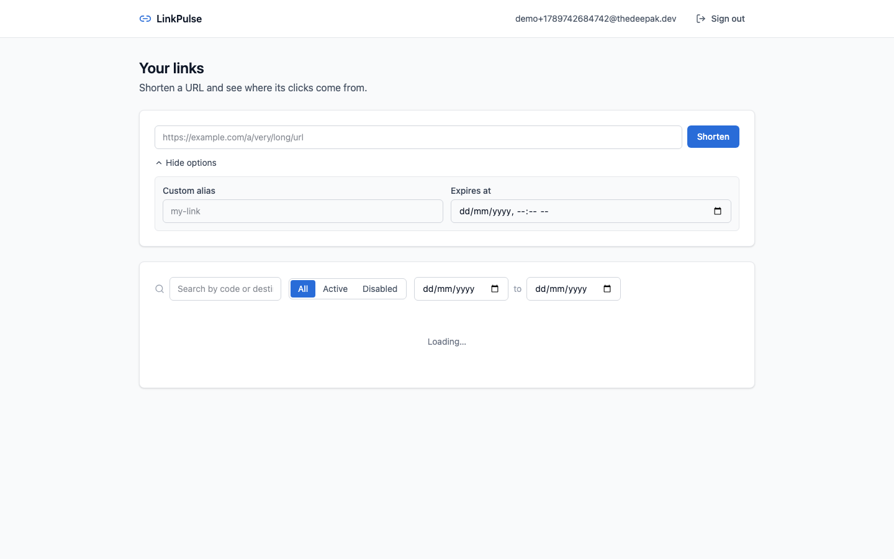
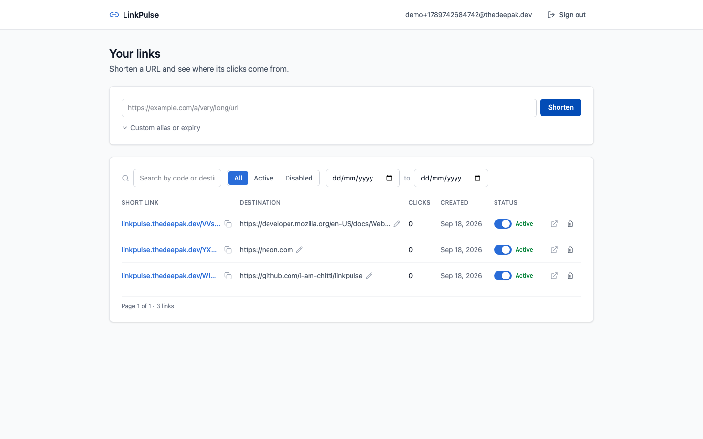
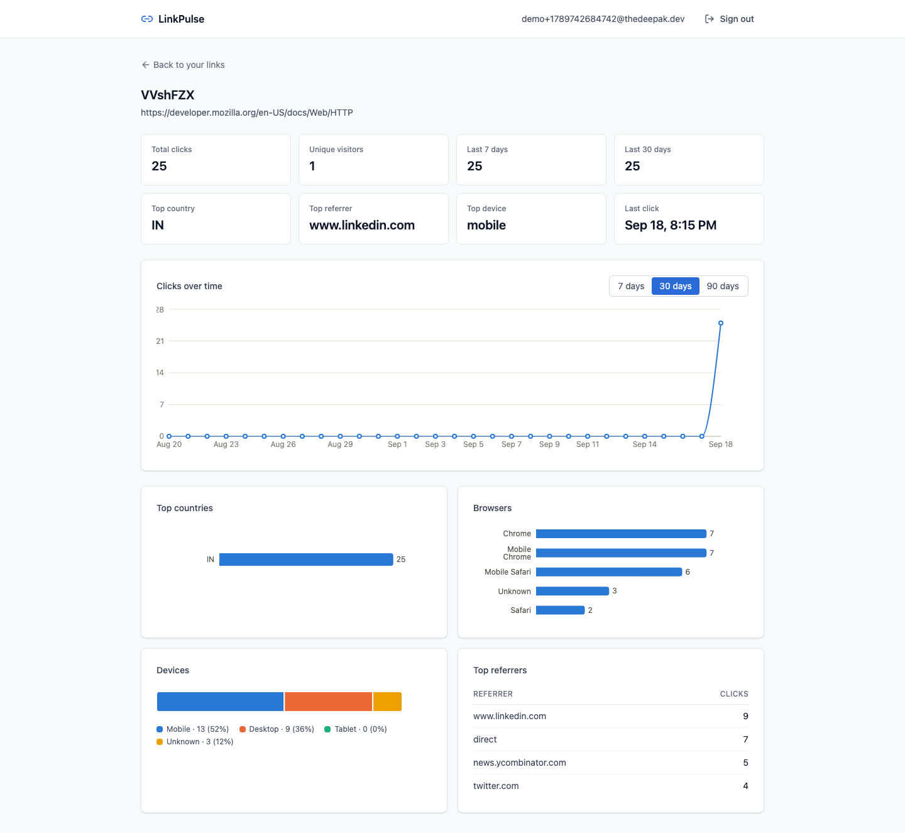

# Screenshots

A visual tour of the live deployment at
[linkpulse.thedeepak.dev](https://linkpulse.thedeepak.dev). Captured against
production with a throwaway demo account - see [README.md](README.md) for
what to run yourself and [ARCHITECTURE.md](ARCHITECTURE.md) for the
reasoning behind what's built.

## Guest shortening - no account needed

The landing page is the guest-mode flow itself, not a marketing page in
front of it - shorten a URL immediately, no signup.

## Register

## Dashboard, empty

## Custom alias and expiry

Collapsed by default so the common case (just shorten a URL) stays a
one-field form; expands for the two optional fields when needed.

## Dashboard with links

Search, status/date filters, inline destination editing, and per-link
analytics are all reachable from this one table.

## Per-link analytics

Real traffic against one link: 25 clicks with varied browsers, devices and
referrers, to show the charts populated rather than an empty state. Device
and browser breakdowns as bar charts rather than pie charts, and why, is
covered in [ARCHITECTURE.md](ARCHITECTURE.md#charts-form-before-color).
